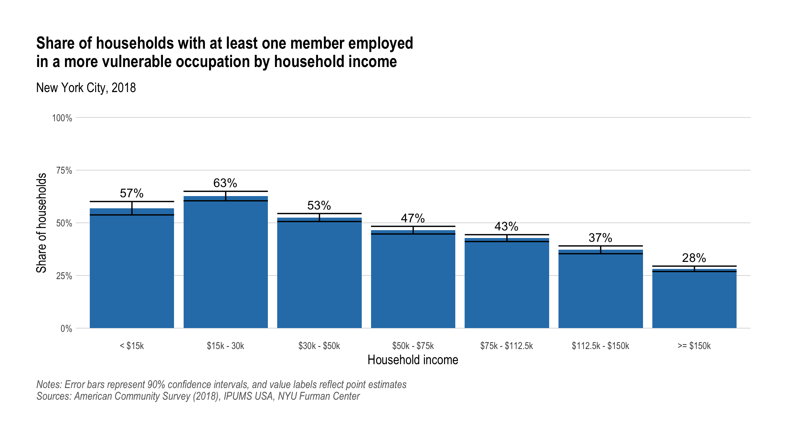
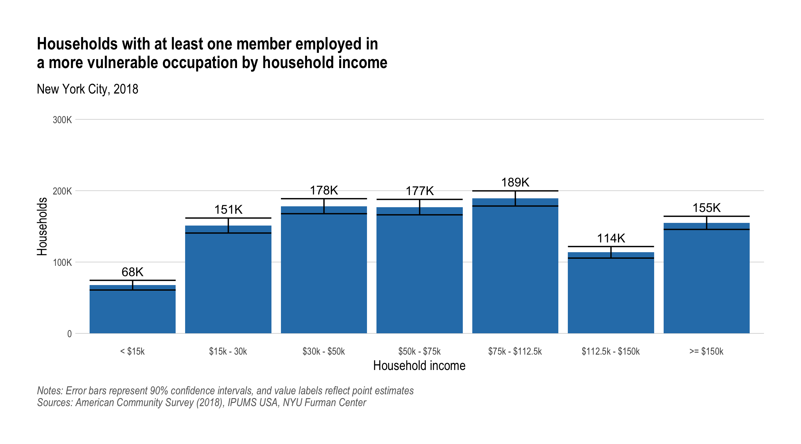
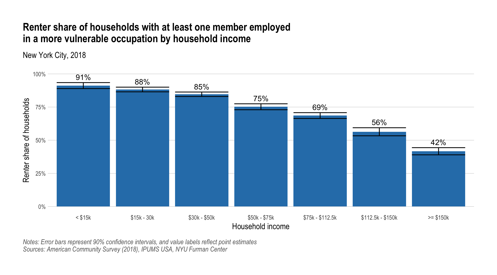
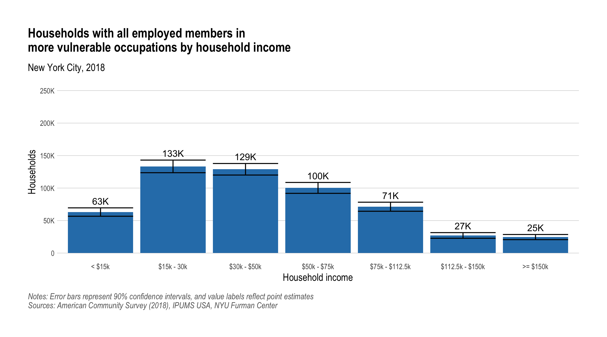
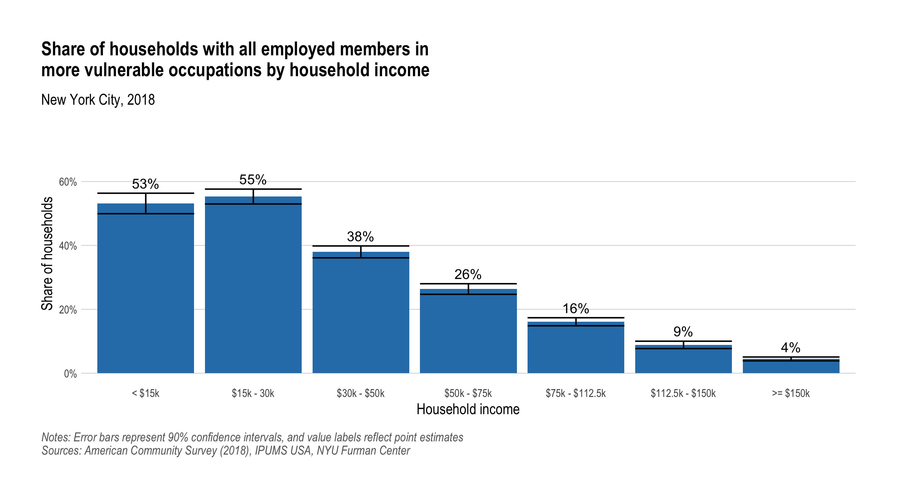
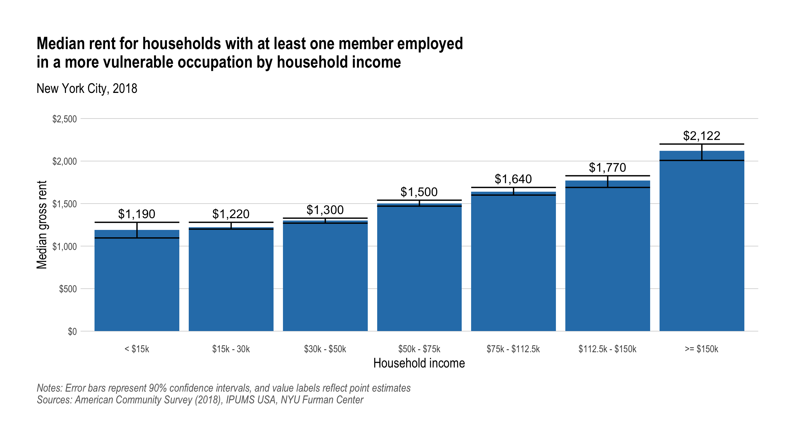
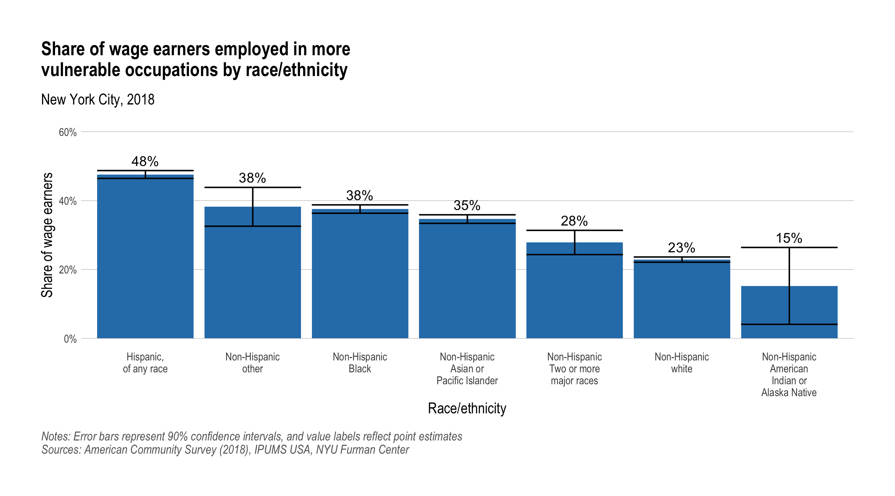

Covid-19 Occupation Analysis
================

``` r
# Install required packages 

# pkgs <- c(
#   "tidyverse",
#   "googlesheets4",
#   "hrbrthemes",
#   "srvyr",
#   "knitr",
#   "rmarkdown",
#   "dotenv"
# )

# install.packages(pkgs)
```

``` r
library(tidyverse) # general data manipulation and graphing
library(googlesheets4) # google sheets
library(srvyr) # survey functions
library(knitr) # markdown table with kable()
library(dotenv) # load environment variables from ".env" file

# Load custom functions to help with plotting
source("R/utils.R")

# No scientific notation in outputs
options(scipen = 999)

# Interactively authorize the {googlesheets4} package to access your Google
# account and then cache the authorization token for subsequent uses.

# You must set your google email in the ".env" file (see ".env_sample")
options(
  gargle_oauth_email = Sys.getenv("GOOGLE_EMAIL"),
  gargle_oauth_cache = ".cache"
)

sheets_auth()
```

### Vulnerable Occupations

To conduct this analysis we used IPUMS occupation code (`occ`) to
separate occupations into two categories: those with the highest risk of
mass layoffs and workplace closures due to the pandemic; and those
likely to be more protected from widespread disruption. For more
information on our the approach, see our blog post based on this
analysis [*What are the Housing Costs of Households Most Vulnerable to
Job Layoffs? An Initial
Analysis*](https://furmancenter.org/thestoop/entry/what-are-the-housing-costs-of-households-most-vulnerable-to-job-layoffs-an).

We invite constructive criticism and a dialogue over the methodology for
classifying these occupation. You can view and comment on the
classification in this [Google
Sheet](https://docs.google.com/spreadsheets/d/18dmgZC_sQZOc9AxETwqs7Wc9P6QmCG62y40wlFxXMMk),
and we look forward to any advice or feedback you might have.

``` r
# Read in the occupation risk classification

occ_risk_sheet <- "https://docs.google.com/spreadsheets/d/18dmgZC_sQZOc9AxETwqs7Wc9P6QmCG62y40wlFxXMMk"

occ_risk_xwalk <- occ_risk_sheet %>% 
  read_sheet(col_types = "ld___", col_names = c("risk_group", "occ"), skip = 1)
```

### Data Preparation

``` r
# Read in IPUMS USA ACS microdata, filter to desired geography
ipums_raw <- read_csv("data/ipums_acs-2018-1yr_ny.csv") %>% 
  rename_all(str_to_lower) %>% 
  filter(
    # Keep only NYC
    statefip == 36,
    countyfip %in% c(5, 47, 61, 81, 85)
  )
```

``` r
# Create all person- and household-level variables for analysis

ipums_clean <- ipums_raw %>% 
  filter(
    # Remove group quarters population
    gq %in% 1:2 
  ) %>% 
  # Join in risk_group occupation flag
  left_join(occ_risk_xwalk, by = "occ") %>%
  mutate(
    # Set missing values
    inc_wages = incwage %>% na_if(999999) %>% na_if(999998) %>% na_if(0),
    
    # There are lots of people with occupation codes but no wages, for this
    # analysis we'll count them as not having that occupation, and like people
    # without an OCC code will have risk_group=NA
    risk_group = if_else(is.na(inc_wages), NA, risk_group),
    risk_group_lab = if_else(risk_group, "More vulnerable", "Less vulnerable"),
    
    risk_wages = if_else(risk_group, inc_wages, NA_real_),
    
    # Household income
    hh_inc_nom = case_when(
      hhincome <= 0 ~ 0,
      hhincome == 9999999 ~ NA_real_, 
      TRUE ~ hhincome
    ),
    hh_inc_grp = cut(
      hh_inc_nom, c(-Inf, 15e3, 30e3, 50e3, 75e3, 112.5e3, 150e3, Inf),
      c("< $15k", "$15k - 30k", "$30k - $50k", "$50k - $75k", "$75k - $112.5k", "$112.5k - $150k", ">= $150k"),
      include.lowest = TRUE, 
      ordered_result = TRUE
    ),
  
    # Various renter variables. These are household level variables, and will
    # only be used later after filtering to one row per household.
    is_renter = (ownershp == 2),
    gross_rent_nom = if_else(is_renter, rentgrs, NA_real_),
    gross_rent_grp = cut(
      gross_rent_nom, 
      c(-Inf, 600, 1000, 1400, 1800, 2200, Inf),
      c("< $600", "$600 - 1,000", "$1,000 - $1,400", "$1,400 - $1,800", "$1,800 - $2,200", ">= $2,200"),
      include.lowest = TRUE, 
      ordered_result = TRUE
    ),
    is_rent_burdened = (rentgrs > (hh_inc_nom / 12 * 0.30)),
    is_rent_burdened_sev = (rentgrs > (hh_inc_nom / 12 * 0.50)),
    is_rent_burdened_mod = (is_rent_burdened) & (!is_rent_burdened_sev),
    
    # Race/ethnicity labels for graph
    race_name = case_when(
      hispan %in% 1:4 ~ "Hispanic,\nof any race",
      race == 1 ~ "Non-Hispanic\nwhite",
      race == 2 ~ "Non-Hispanic\nBlack",
      race == 3 ~ "Non-Hispanic\nAmerican\nIndian or\nAlaska Native",
      race == 4 ~ "Non-Hispanic\nAsian or\nPacific Islander", # Chinese
      race == 5 ~ "Non-Hispanic\nAsian or\nPacific Islander", # Japanese
      race == 6 ~ "Non-Hispanic\nAsian or\nPacific Islander", # Other Asian or Pacific Island
      race == 7 ~ "Non-Hispanic\nother",
      race == 8 ~ "Non-Hispanic\nTwo or more\nmajor races", # Two major races
      race == 9 ~ "Non-Hispanic\nTwo or more\nmajor races" # Three or more major races
    )
  ) %>% 
  # Group by household and categorize households based or occupations of members
  group_by(serial) %>% 
  mutate(
    # Household with at least one wage earner in a more vulnerable occupation
    
    # If there are no members with wages then NA, if there are any at-risk
    # people with wages then TRUE, if there are people with wages but none of
    # them are at risk then FALSE
    hh_any_risk = case_when(
      all(is.na(risk_group)) ~ NA, # no wage earners
      any(risk_group, na.rm = TRUE) ~ TRUE, # any wage earners are at risk
      all(!risk_group, na.rm = TRUE) ~ FALSE # all wage earners are at NOT at risk
    ),
    
    # Household with all wage earners in more vulnerable occupations
    
    # If all members have no wag income then NA, if all the wage earners are in
    # the risk group then TRUE, if there are members with wage income but
    # none/only some are at risk then FALSE
    hh_all_risk = case_when(
      all(is.na(risk_group)) ~ NA, # no wage earners
      all(risk_group, na.rm = TRUE) ~ TRUE, # all wage earners are at risk
      any(!risk_group, na.rm = TRUE) ~ FALSE # not all wage earners are at risk
    ),
    
    # The total wages for each household that come from vulnerable occupations
    hh_risk_wages = sum(risk_wages, na.rm = TRUE),
    
    # The percent of household income that comes from wages from vulnerable occupations
    hh_risk_wages_pct = sum(risk_wages, na.rm = TRUE) / na_if(hh_inc_nom, 0)
  ) %>% 
  ungroup()
```

### Graphs

``` r
# Share of households with at least one member employed in a more vulnerable
# occupation by household income

p <- ipums_clean %>% 
  filter(
    pernum == 1, # keep only one row per household
    !is.na(hh_any_risk) # remove households with no wage earners
  ) %>% 
  as_survey_design(weights = hhwt) %>% 
  group_by(hh_inc_grp, .drop = FALSE) %>% 
  summarise(risk_pct = survey_mean(hh_any_risk, vartype = "ci", level = 0.90)) %>% 
  ungroup() %>% 
  fc_col_plot(
    x = hh_inc_grp,
    y = risk_pct,
    ymin = risk_pct_low,
    ymax = risk_pct_upp,
    y_limits = c(0, 1),
    y_format = "percent"
  ) +
  labs(
    title = str_glue(
      "Share of households with at least one member employed 
      in a more vulnerable occupation by household income"
    ),
    subtitle = "New York City, 2018",
    x = "Household income",
    y = str_glue("Share of households"),
    caption = str_glue(
      "Notes: Error bars represent 90% confidence intervals, and value labels reflect point estimates
      Sources: American Community Survey (2018), IPUMS USA, NYU Furman Center"
    )
  )

plot_save_include("img/nyc_occ-risk-any_share-income.png")
```

<!-- -->

``` r
# Households with at least one member employed in a more vulnerable occupation
# by household income

p <- ipums_clean %>% 
  filter(
    pernum == 1, # keep only one row per household
    hh_any_risk # keep only households with at least one wage earner in vulnerable occupation
  ) %>% 
  as_survey_design(weights = hhwt) %>% 
  group_by(hh_inc_grp, .drop = FALSE) %>% 
  summarise(households = survey_total(vartype = "ci", level = 0.90)) %>% 
  ungroup() %>% 
  fc_col_plot(
    x = hh_inc_grp,
    y = households,
    y_limits = c(0, 300000),
    ymin = households_low,
    ymax = households_upp,
    y_format = "si"
  ) +
  labs(
    title = str_glue(
      "Households with at least one member employed in
      a more vulnerable occupation by household income"
    ),
    subtitle = "New York City, 2018",
    x = "Household income",
    y = "Households",
    caption = str_glue(
      "Notes: Error bars represent 90% confidence intervals, and value labels reflect point estimates
      Sources: American Community Survey (2018), IPUMS USA, NYU Furman Center"
    )
  )

plot_save_include("img/nyc_occ-risk-any_households-income.png")
```

<!-- -->

``` r
# Renter share of households with at least one member employed in a more
# vulnerable occupation by household income

p <- ipums_clean %>% 
  filter(
    pernum == 1, # keep only one row per household
    hh_any_risk # keep only households with at least one wage earner in vulnerable occupation
  ) %>% 
  as_survey_design(weights = hhwt) %>% 
  group_by(hh_inc_grp, .drop = FALSE) %>% 
  summarise(renter_pct = survey_mean(is_renter, vartype = "ci", level = 0.90)) %>% 
  ungroup() %>% 
  fc_col_plot(
    x = hh_inc_grp,
    y = renter_pct,
    y_limits = c(0, 1),
    ymin = renter_pct_low,
    ymax = renter_pct_upp,
    y_format = "percent"
  ) +
  labs(
    title = str_glue(
      "Renter share of households with at least one member employed
      in a more vulnerable occupation by household income"
    ),
    subtitle = "New York City, 2018",
    x = "Household income",
    y = str_glue("Renter share of households"),
    caption = str_glue(
      "Notes: Error bars represent 90% confidence intervals, and value labels reflect point estimates
      Sources: American Community Survey (2018), IPUMS USA, NYU Furman Center"
    )
  )

plot_save_include("img/nyc_occ-risk-any_renter-share-income.png")
```

<!-- -->

``` r
# Households with all employed members in more vulnerable occupations by
# household income

p <- ipums_clean %>% 
  filter(
    pernum == 1, # keep only one row per household
    hh_any_risk # keep only households with at least one wage earner in vulnerable occupation
  ) %>% 
  as_survey_design(weights = hhwt) %>% 
  group_by(hh_inc_grp, .drop = FALSE) %>% 
  summarise(households = survey_total(vartype = "ci", level = 0.90)) %>% 
  ungroup() %>% 
  fc_col_plot(
    x = hh_inc_grp,
    y = households,
    y_limits = c(0, 250000),
    ymin = households_low,
    ymax = households_upp,
    y_format = "si"
  ) +
  labs(
    title = str_glue(
      "Households with all employed members in
      more vulnerable occupations by household income"
    ),
    subtitle = "New York City, 2018",
    x = "Household income",
    y = "Households",
    caption = str_glue(
      "Notes: Error bars represent 90% confidence intervals, and value labels reflect point estimates
      Sources: American Community Survey (2018), IPUMS USA, NYU Furman Center"
    )
  )

plot_save_include("img/nyc_occ-risk-all_households-income.png")
```

<!-- -->

``` r
# Share of households with all employed members in more vulnerable occupations
# by household income

p <- ipums_clean %>% 
  filter(
    pernum == 1, # keep only one row per household
    !is.na(hh_all_risk) # keep only households with at least one wage earner
  ) %>% 
  as_survey_design(weights = hhwt) %>% 
  group_by(hh_inc_grp, .drop = FALSE) %>% 
  summarise(risk_pct = survey_mean(hh_all_risk, vartype = "ci", level = 0.90)) %>% 
  ungroup() %>% 
  fc_col_plot(
    x = hh_inc_grp,
    y = risk_pct,
    y_limits = c(0, 0.75),
    ymin = risk_pct_low,
    ymax = risk_pct_upp,
    y_format = "percent"
  ) +
  labs(
    title = str_glue(
      "Share of households with all employed members in
      more vulnerable occupations by household income"
    ),
    subtitle = "New York City, 2018",
    x = "Household income",
    y = str_glue("Share of households"),
    caption = str_glue(
      "Notes: Error bars represent 90% confidence intervals, and value labels reflect point estimates
      Sources: American Community Survey (2018), IPUMS USA, NYU Furman Center"
    )
  )
  
plot_save_include("img/nyc_occ-risk-all_share-income.png")
```

<!-- -->

``` r
# Median rent for households with at least one member employed in a more
# vulnerable occupation by household income

p <- ipums_clean %>% 
  filter(
    pernum == 1, # keep only one row per household
    hh_any_risk, # keep only households with at least one wage earner in vulnerable occupation
    is_renter # keep only renter households
  ) %>% 
  as_survey_design(weights = hhwt) %>% 
  group_by(hh_inc_grp, .drop = FALSE) %>% 
  summarise(gross_rent_nom_med = survey_median(gross_rent_nom, vartype = "ci", level = 0.90)) %>% 
  ungroup() %>% 
  fc_col_plot(
    x = hh_inc_grp,
    y = gross_rent_nom_med,
    y_limits = c(0, 2500),
    ymin = gross_rent_nom_med_low,
    ymax = gross_rent_nom_med_upp,
    y_format = "dollar"
  ) +
  labs(
    title = str_glue(
      "Median rent for households with at least one member employed 
      in a more vulnerable occupation by household income"
    ),
    subtitle = "New York City, 2018",
    x = "Household income",
    y = "Median gross rent",
    caption = str_glue(
      "Notes: Error bars represent 90% confidence intervals, and value labels reflect point estimates
      Sources: American Community Survey (2018), IPUMS USA, NYU Furman Center"
    )
  )

plot_save_include("img/nyc_occ-risk-any_rent-income.png")
```

<!-- -->

``` r
# Share of wage earners employed in more vulnerable occupations by
# race/ethnicity

p <- ipums_clean %>% 
  filter(
    !is.na(risk_group) # keep only wage earners
  ) %>% 
  as_survey_design(weights = perwt) %>% 
  group_by(race_name, .drop = FALSE) %>% 
  summarise(pop_pct = survey_mean(risk_group, vartype = "ci", level = 0.90)) %>% 
  ungroup() %>% 
  mutate(race_name = fct_reorder(race_name, -pop_pct)) %>% 
  fc_col_plot(
    x = race_name,
    y = pop_pct,
    y_limits = c(0, 0.6),
    ymin = pop_pct_low,
    ymax = pop_pct_upp,
    y_format = "percent"
  ) +
  labs(
    title = str_glue(
      "Share of wage earners employed in more
      vulnerable occupations by race/ethnicity"
    ),
    subtitle = "New York City, 2018",
    x = "Race/ethnicity",
    y = str_glue("Share of wage earners"),
    caption = str_glue(
      "Notes: Error bars represent 90% confidence intervals, and value labels reflect point estimates
      Sources: American Community Survey (2018), IPUMS USA, NYU Furman Center"
    )
  )

plot_save_include("img/nyc_occ-risk_pop-share-race.png")
```

<!-- -->

### Stats

``` r
# Total number of households
hh_total <- ipums_clean %>% 
  filter(
    pernum == 1, # keep only one row per household
  ) %>% 
  as_survey_design(weights = hhwt) %>% 
  summarise(
    households = survey_total(1, vartype = "ci", level = 0.90)
  )

hh_total %>% 
  pivot_longer(everything()) %>% 
  kable()
```

| name            |   value |
| :-------------- | ------: |
| households      | 3184458 |
| households\_low | 3161148 |
| households\_upp | 3207768 |

``` r
# Total number of wage earners
wage_earners_total <- ipums_clean %>% 
  filter(inc_wages >=0) %>% 
  as_survey_design(weights = perwt) %>% 
  summarise(
    individuals = survey_total(1, vartype = "ci", level = 0.90)
  )

wage_earners_total %>% 
  pivot_longer(everything()) %>% 
  kable()
```

| name             |   value |
| :--------------- | ------: |
| individuals      | 4085333 |
| individuals\_low | 4058659 |
| individuals\_upp | 4112007 |

``` r
# Population living in households with at least one wage earner in more vulnerable occupation
pop_hh_risk_any <- ipums_clean %>% 
  filter(hh_any_risk) %>% 
  as_survey_design(weights = perwt) %>% 
  summarise(
    individuals = survey_total(1, vartype = "ci", level = 0.90)
  )

pop_hh_risk_any %>% 
  pivot_longer(everything()) %>% 
  kable()
```

| name             |   value |
| :--------------- | ------: |
| individuals      | 3496121 |
| individuals\_low | 3471727 |
| individuals\_upp | 3520515 |

``` r
# Various stats for households with at least one wage earner in vulnerable occupation
hh_any_risk_stats <- ipums_clean %>% 
  filter(
    pernum == 1, # keep only one row per household
    hh_any_risk # keep only households with at least one wage earner in vulnerable occupation
  ) %>% 
  as_survey_design(weights = hhwt) %>% 
  summarise(
    households = survey_total(1, vartype = "ci", level = 0.90),
    hh_inc_nom_med = survey_median(hh_inc_nom, na.rm = TRUE),
    hh_risk_wages_med = survey_median(hh_risk_wages, na.rm = TRUE),
    hh_risk_wages_pct_med = survey_median(hh_risk_wages_pct, na.rm = TRUE),
    gross_rent_nom_med = survey_median(gross_rent_nom, vartype = "ci", na.rm = TRUE)
  )

hh_any_risk_stats %>% 
  pivot_longer(everything()) %>% 
  kable()
```

| name                          |           value |
| :---------------------------- | --------------: |
| households                    | 1031873.0000000 |
| households\_low               | 1018905.6246131 |
| households\_upp               | 1044840.3753869 |
| hh\_inc\_nom\_med             |   66589.2401216 |
| hh\_inc\_nom\_med\_se         |    1021.3159191 |
| hh\_risk\_wages\_med          |   33292.9347826 |
| hh\_risk\_wages\_med\_se      |     765.2109373 |
| hh\_risk\_wages\_pct\_med     |       0.6511628 |
| hh\_risk\_wages\_pct\_med\_se |       0.0095706 |
| gross\_rent\_nom\_med         |    1480.0000000 |
| gross\_rent\_nom\_med\_low    |    1450.0000000 |
| gross\_rent\_nom\_med\_upp    |    1500.0000000 |

``` r
# Various stats for households with all wage earners in vulnerable occupations
hh_all_risk_stats <- ipums_clean %>% 
  filter(
    pernum == 1, # keep only one row per household
    hh_all_risk # keep only households with all wage earners in vulnerable occupations
  ) %>% 
  as_survey_design(weights = hhwt) %>% 
  summarise(
    households = survey_total(1, vartype = "ci", level = 0.90),
    hh_inc_nom_med = survey_median(hh_inc_nom, na.rm = TRUE),
    hh_risk_wages_med = survey_median(hh_risk_wages, na.rm = TRUE),
    hh_risk_wages_pct_med = survey_median(hh_risk_wages_pct, na.rm = TRUE),
    gross_rent_nom_med = survey_median(gross_rent_nom, vartype = "ci", na.rm = TRUE)
  )

hh_all_risk_stats %>% 
  pivot_longer(everything()) %>% 
  kable()
```

| name                          |       value |
| :---------------------------- | ----------: |
| households                    | 548652.0000 |
| households\_low               | 538877.9518 |
| households\_upp               | 558426.0482 |
| hh\_inc\_nom\_med             |  41200.0000 |
| hh\_inc\_nom\_med\_se         |    969.1174 |
| hh\_risk\_wages\_med          |  33757.1429 |
| hh\_risk\_wages\_med\_se      |    765.0927 |
| hh\_risk\_wages\_pct\_med     |      1.0000 |
| hh\_risk\_wages\_pct\_med\_se |      0.0000 |
| gross\_rent\_nom\_med         |   1350.0000 |
| gross\_rent\_nom\_med\_low    |   1310.0000 |
| gross\_rent\_nom\_med\_upp    |   1387.1656 |

``` r
# Various stats for households making less than $150k and with at least one wage
# earner in a more vulnerable occupation
hh_any_risk_lt150k <- ipums_clean %>% 
  filter(
    pernum == 1, # keep only one row per household
    hh_any_risk,
    hh_inc_nom <150000
  ) %>% 
  as_survey_design(weights = hhwt) %>% 
  summarise(
    households = survey_total(1, vartype = "ci", level = 0.90),
    hh_inc_nom_med = survey_median(hh_inc_nom, na.rm = TRUE),
    hh_risk_wages_med = survey_median(hh_risk_wages, na.rm = TRUE),
    hh_risk_wages_pct_med = survey_median(hh_risk_wages_pct, na.rm = TRUE),
    gross_rent_nom_med = survey_median(gross_rent_nom, na.rm = TRUE)
  )

hh_any_risk_lt150k %>% 
  pivot_longer(everything()) %>% 
  kable()
```

| name                          |          value |
| :---------------------------- | -------------: |
| households                    | 872156.0000000 |
| households\_low               | 860239.8717704 |
| households\_upp               | 884072.1282296 |
| hh\_inc\_nom\_med             |  55000.0000000 |
| hh\_inc\_nom\_med\_se         |    850.8103283 |
| hh\_risk\_wages\_med          |  30000.0000000 |
| hh\_risk\_wages\_med\_se      |      0.0000000 |
| hh\_risk\_wages\_pct\_med     |      0.7319793 |
| hh\_risk\_wages\_pct\_med\_se |      0.0140094 |
| gross\_rent\_nom\_med         |   1430.0000000 |
| gross\_rent\_nom\_med\_se     |     15.3025870 |

``` r
# Various stats for households making less than $150k and with all wage earners
# in a more vulnerable occupation
hh_all_risk_lt150k <- ipums_clean %>% 
  filter(
    pernum == 1, # keep only one row per household
    hh_all_risk,
    hh_inc_nom <150000
  ) %>% 
  as_survey_design(weights = hhwt) %>% 
  summarise(
    households = survey_total(1, vartype = "ci", level = 0.90),
    hh_inc_nom_med = survey_median(hh_inc_nom, na.rm = TRUE),
    hh_risk_wages_med = survey_median(hh_risk_wages, na.rm = TRUE),
    hh_risk_wages_pct_med = survey_median(hh_risk_wages_pct, na.rm = TRUE),
    gross_rent_nom_med = survey_median(gross_rent_nom, na.rm = TRUE)
  )

hh_all_risk_lt150k %>% 
  pivot_longer(everything()) %>% 
  kable()
```

| name                          |        value |
| :---------------------------- | -----------: |
| households                    | 521588.00000 |
| households\_low               | 512056.84270 |
| households\_upp               | 531119.15730 |
| hh\_inc\_nom\_med             |  40000.00000 |
| hh\_inc\_nom\_med\_se         |    518.39144 |
| hh\_risk\_wages\_med          |  31700.00000 |
| hh\_risk\_wages\_med\_se      |    816.08389 |
| hh\_risk\_wages\_pct\_med     |      1.00000 |
| hh\_risk\_wages\_pct\_med\_se |      0.00000 |
| gross\_rent\_nom\_med         |   1330.00000 |
| gross\_rent\_nom\_med\_se     |     17.85005 |
